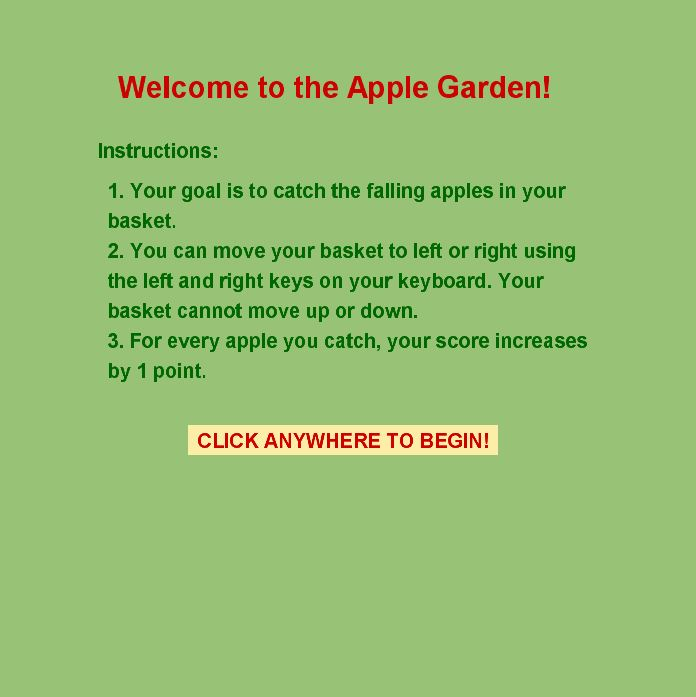
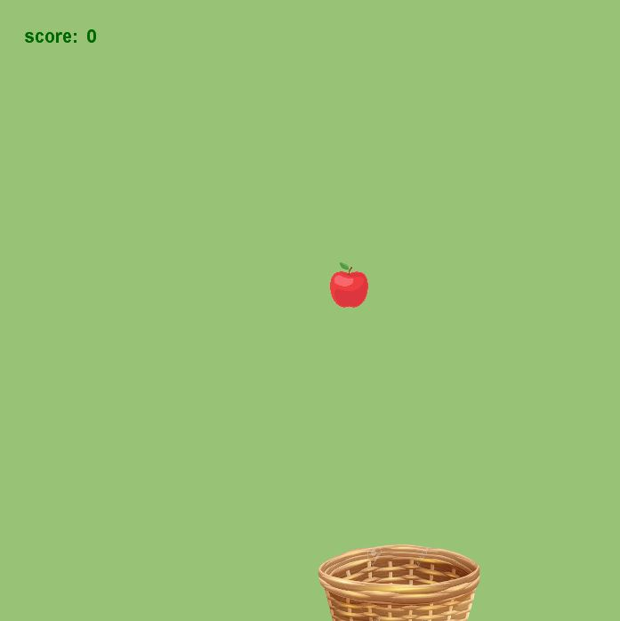

## Documentation

### Instructions for the Player
These are the game instructions that are displayed at the beginning of each game:
1. Your goal is to catch the falling apples in your basket.
2. You can move your basket to left or right using the left and right keys on your keyboard. Your basket cannot move up or down. 
3. For every apple you catch, your score increases by 1 point. 

### Game Stages/Screens
The game opens on this screen:



Upon the clicking of the mouse by the user, the game screen is displayed:



After the game is lost, the following screen is displayed:


### Challenges & Solutions
1. After I started coding my game plan and had the basic game down, the next main challenge I ran into was incorporating object oriented programming into my existing code. I wanted to create separate classes to encapsulate the falling apples and the horizontally-moving basket. A problem I got stuck on was that the x-coordinate of the basket ```(basketX)``` was local to the basket class, but I was referring to it in the apples class (in order to determine if the apple was falling into the basket). It took me a while to figure out this simple problem, but I solved it by making ```basketX``` a global variable that could then be easily referenced in both classes. 

2. The next problem I faced was figuring out the ```if``` condition for when the apple falls into the basket. I initially coded it with the numbers that made sense mathematically (i.e. as ```(appleY > 600 && appleX < basketX + 200 && appleX > basketX)``` but I didn't take into consideration the thickness of the basket (in the particular basket image used). So sometimes the apple would fall onto the outer part of basket but still count as a win. I fixed these by simply playing around with the numbers.

3. The final and biggest challenge I faced was with figuring out how to code some sort of end to the game. The apples just kept falling perpetually the way I had coded it initially. I fixed this by first deciding on a game ending: it would end once one of the falling apples was not caught. I implemented a switch such that this would result in the ending screen being displayed, with an option to restart the game.
