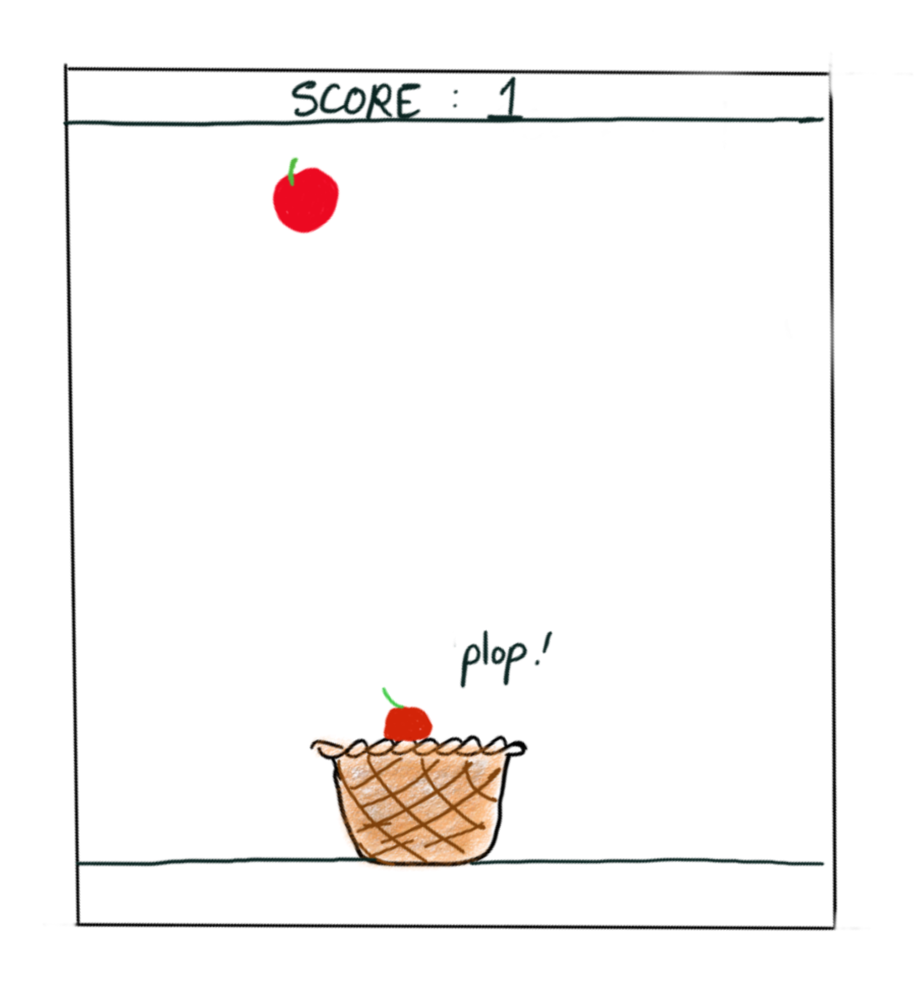
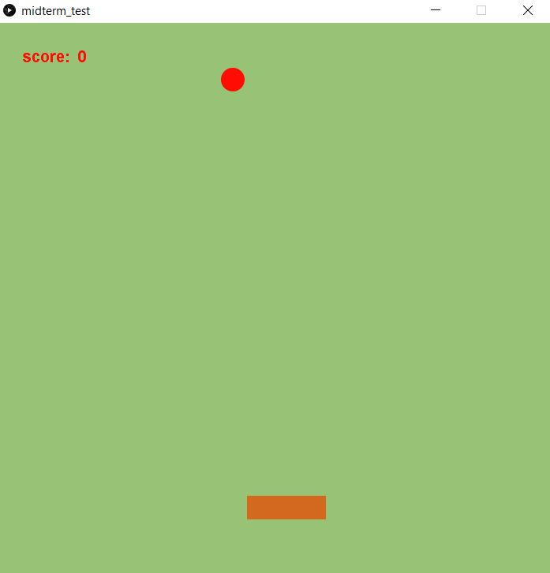
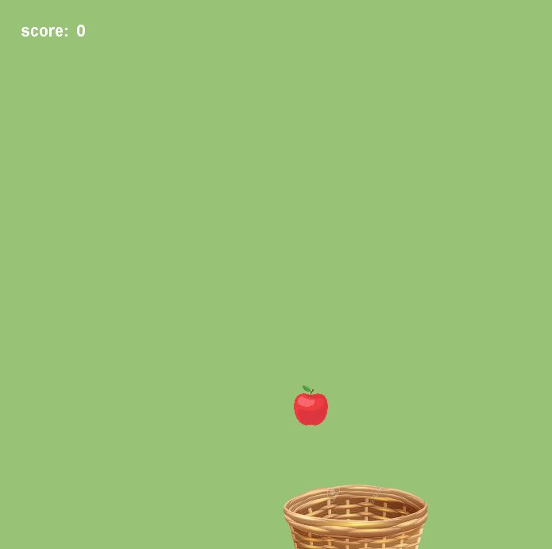

### Current plan: In this midterm project, I intend to create a game where the player has a basket and has to catch all the falling apples. 

#### June 7: 
The plan was to create a maze game, where the player would have to collect rewards as they find their way through the maze. My intended course of action was to use a maze image as the background, and superimpose the player (probably a circle) and the rewards (other pretty circles) on top of this. 

#### June 8:
As I began to work on this plan, I quickly realized the glaring flaw in this plan. If I were to execute this plan as it is, there would be no way to control where the player could move, since the maze is just a passive background image. I would need to manually put down the lines that make up the maze, in order for to have control over their locations and actually be able to differentiate between walls/openings so that the player would not be allowed to move over walls.  

I changed my plan to a different game - one in which there was a basket at the bottom of the screen, and apples falling from the sky. The player can move the basket horizontlly either using their mouse or the left/right keys on their keyboard. A sketch of the intended game is shown below:

  

So far I have implemented the falling apples. For now, the apples are just circles.

#### June 10:
Today, I implemented a horizontal, brown bar that moves left and right (when the corresponding keys are pressed). This represents the basket. I need to now figure out how to replace this with an image of a basket. 

I also added the text for the score at the top of the screen. I have coded a variable to represent the score, but it is faulty as of now. 

This is what the game looks like now:

  
  
#### June 11:

I replaced the primitive shapes of the circle and rectangle with images of an apple and a basket respectively. I also fixed the score variable to display the correct score. This is what the game looks like now:

  

#### June 12:
I organized the apple and basket-related code into classes. I also added beginning and ending screens to the game, coordinating the colors. 

#### June 13:
Today, I implemented an end to the game. Once an apple does not fall into the basket, the game is lost and the screen switches. 

